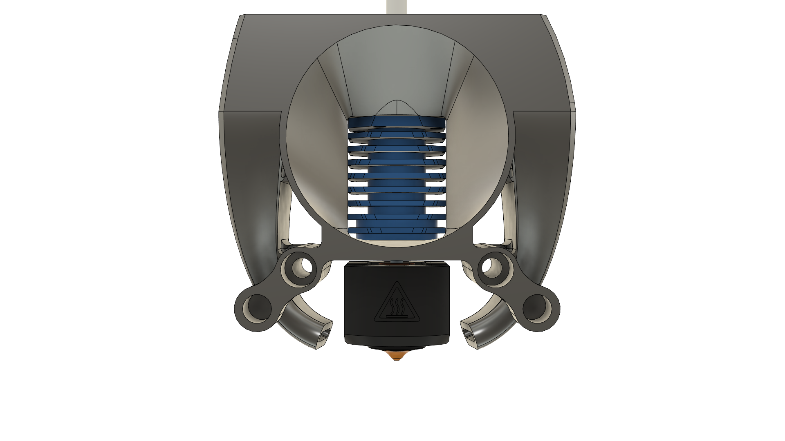
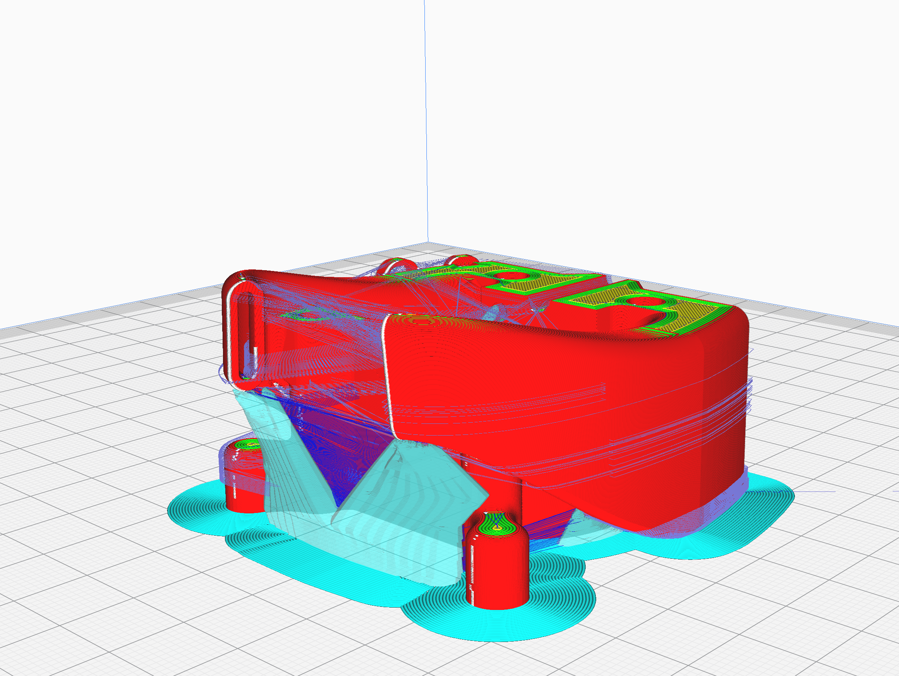
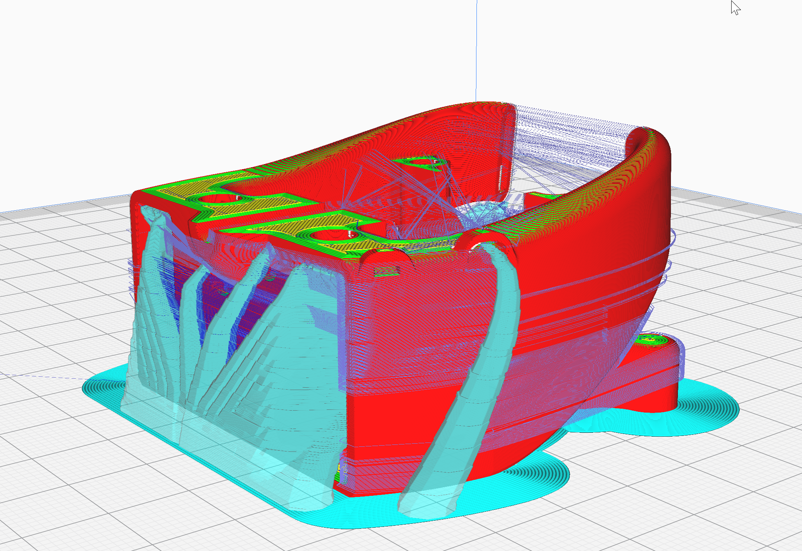
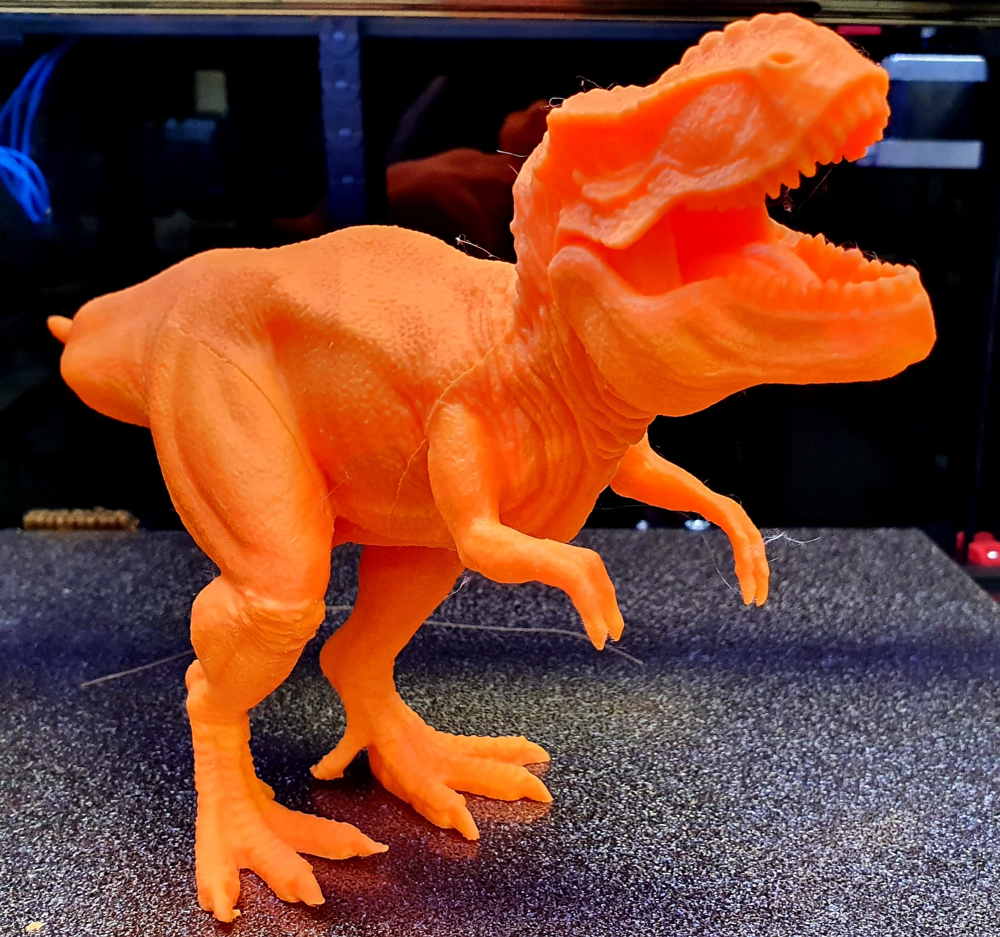

# Dragonfly BMO Fan Duct
This Fan Duct for the Dragonfly BMO, is designed to improve the quality of PLA prints in the Afterburner. It is a remix of the Fan Duc from the original CAD file of the [Voron Afterburner](https://github.com/VoronDesign/Voron-Afterburner) and inspiert bei the [Halo Duct](https://github.com/tsitalon1/VoronUsers/tree/master/HaloDuct) from James Gillette. I share also my CAD file so, feel free to create your own version

I use Cura for slicing this moddel. In cura I use the Tree-Support. In STL folder you found my cura profile. This was used for Printing on my SOVOL SV01.  

I Printet a sample model in PLA https://www.thingiverse.com/thing:2306188 and think the result is exelent. I use Cura with speed of 200mm/s
